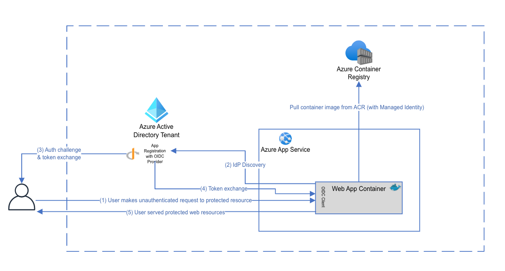
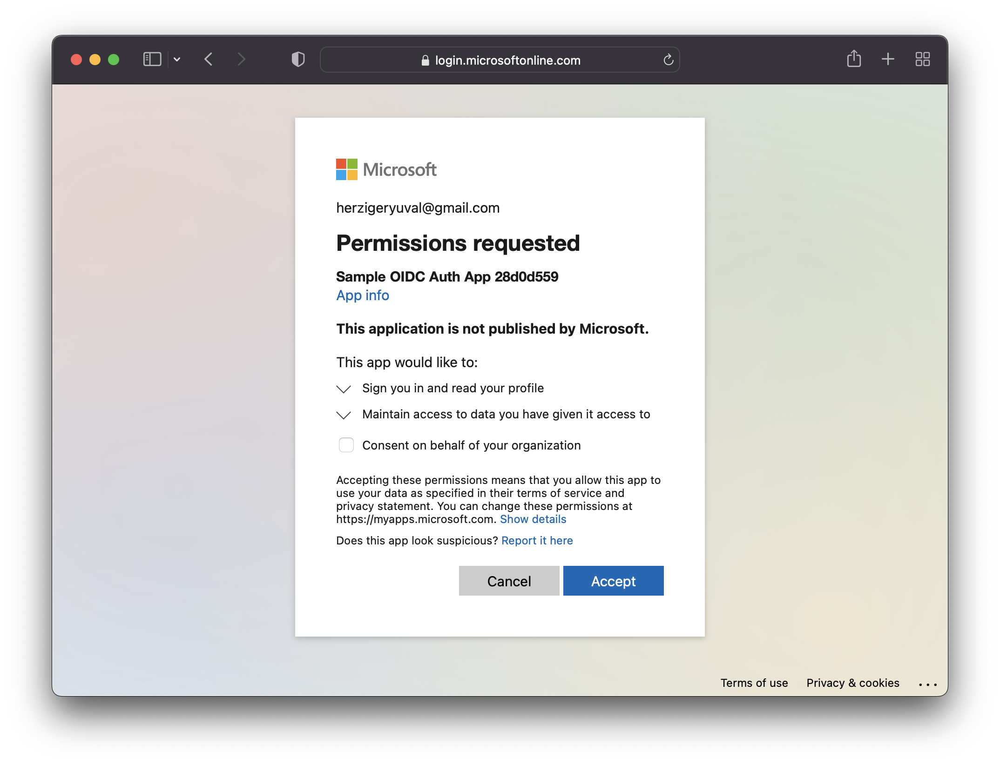
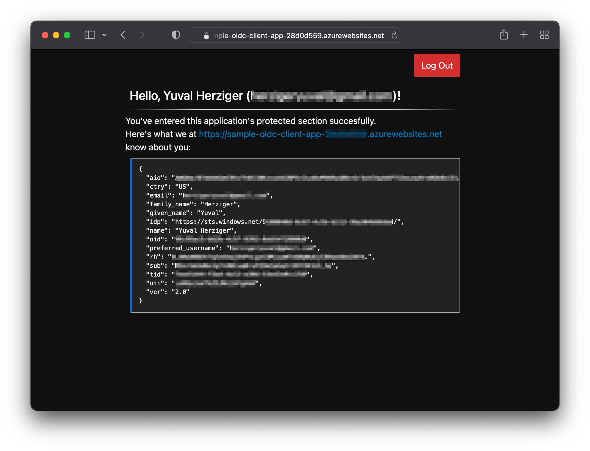

# App Service Container with OIDC Client Authentication


This project contains a sample Node.js server app that

- is built as a docker image and pushed into an ACR container repo;
- is deployed as an Azure App Service resource using Terraform (see below) or Bicep (coming soon);
- authenticates with Azure Active Directory over OIDC, in a way that the application can consume custom token claims.

## Features

[Azure App Service](https://docs.microsoft.com/en-us/azure/app-service/overview), similarly to other compute services in Azure, supports built-in authentication using [Azure Active Directory](https://docs.microsoft.com/en-us/azure/active-directory/authentication/overview-authentication).
However, in some cases, you would want to have the authenticating client implemented in your workload with its own OpenID Connect client, sample reasons:

- You need to consume/use custom claims from your user's tokens.
- You have an existing application with established permissions, roles, and attributes, yet you need
  to map them to Azure AD user claims (e.g., Azure Application Roles should be mapped to your application's roles).
- You have a requirement to protect only subsets of your endpoints with OIDC.



## Getting Started

### Prerequisites

(ideally very short, if any)

- [Terraform CLI](https://learn.hashicorp.com/tutorials/terraform/install-cli) - you'll need to install the Terraform CLI in order
  to provision resources.
- [Docker](https://docs.docker.com/desktop/) - you'll need to have Docker installed in order to build the app's image
- [Azure CLI](https://docs.microsoft.com/en-us/cli/azure/install-azure-cli) - you'll need to have Azure CLI installed in order
  to log into Azure from your terminal.
- A Linux/WSL/macOS terminal

### Installation

#### Step 1: Build the Image

In order to build the application's image, run the following command:

```bash
make build-image
```

Please note that you might be required to authenticate with [Docker Hub](https://hub.docker.com/). Depending on your operating system,
you might need to run it in an elevated manner:

```bash
sudo make build-image
```

You can verify the image has been built successfully by running `docker images`.  You should see
a line indicating that the `sample-oidc-client-app` is present in your Docker daemon, e.g.:

```zsh
REPOSITORY              TAG       IMAGE ID       CREATED       SIZE
sample-oidc-client-app  latest    93f1bd0ceefc   6 hours ago   118MB
```

#### Step 2: Log In with the Azure CLI

You can authenticate with Azure using the following CLI command:

```bash
az login
```

Please note that if you have multiple Azure profiles configured, you might want
to set the current Azure subscription explicitly with its subscription ID. For example:

```bash
az account set --subscription ${SUBSCRIPTION_ID}
```

#### Step 3: Configure the Deployment

Before you can deploy the resource using Terraform, you will need to configure the deployment.

First, make a copy of the template Terraform variables file:

```bash
cp deploy/terraform/terraform.tfvars.example deploy/terraform/terraform.tfvars
```

You should now have a file named `terraform.tfvars` under the `deploy/terraform` directory.
Your configuration file contains the following variables; change their values as required:

- `subscription_id` (required): Your Azure account's subscription ID.
- `tenant_id` (required): The ID of the Azure Active Directory tenant under which
  you'd like to provision the App Registration in.
- `allow_multiple_orgs` (default: `false`): Whether you'd like the App to allow authentication
  using **any** work/school Azure AD tenant.
- `location` (default: `"eastus"`): The Azure region in which you'd like to provision your resources.

#### Step 4: Deploy

Initialize the Terraform working directory:

```bash
cd deploy/terraform
terraform init
```

Run the following command to validate the deployment:

```bash
terraform plan
```

The output of the `terraform plan` command should be a summary of the resources to be provisioned.

Lastly, deploy the application using the following command:

```bash
terraform apply
```

Please note that this step might take a few minutes.

If all resources were provisioned successfully, you should see a Terraform output along the following lines:

```zsh
Apply complete! Resources: 10 added, 0 changed, 0 destroyed.

Outputs:

instructions = <<EOT
    ✅ Check your application's health here:

        https://sample-oidc-client-app-28d0d559.azurewebsites.net/health

    ✅ Log into the application here:

        https://sample-oidc-client-app-28d0d559.azurewebsites.net

EOT
```

Once your resources have been deployed, you can check the application's health using the health
endpoint stated in the Terraform output.

Open the application in your browser and you'll be prompted to log in with your Azure account. After
logging in, you'll need to give your consent for the application to read information based on the desired
scope:



Once you're in, you should see everything the application knows about you, based on
the ID token Azure AD provided it:



## Resources

- [Azure AD App Registration Documentation](https://docs.microsoft.com/en-us/graph/auth-register-app-v2)
- [Azure App Service Documentation](https://docs.microsoft.com/en-us/azure/app-service/overview)
- [Terraform registry](https://www.terraform.io/registry/providers)
- [How to write Dockerfiles](https://docs.docker.com/engine/reference/builder/)
